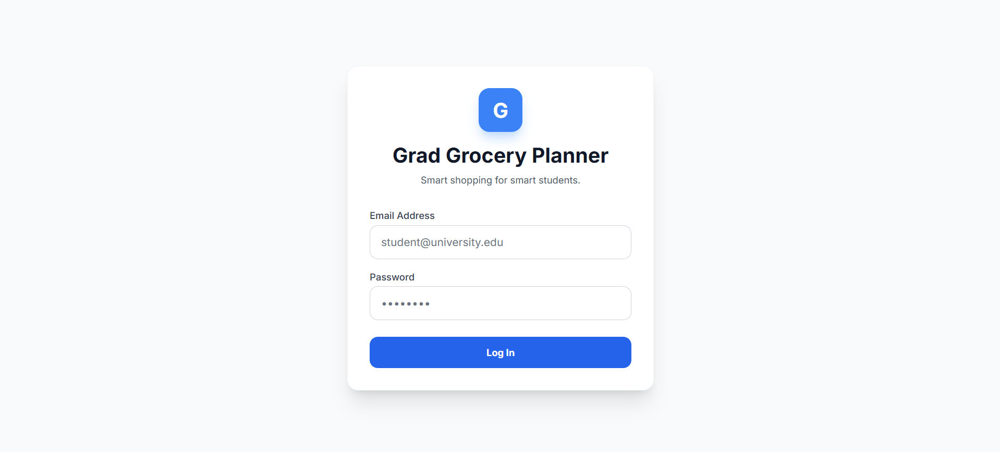
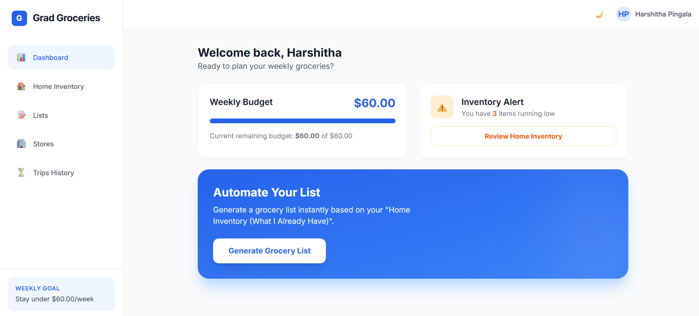
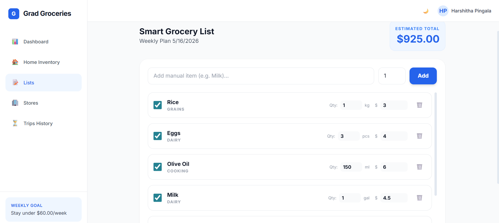
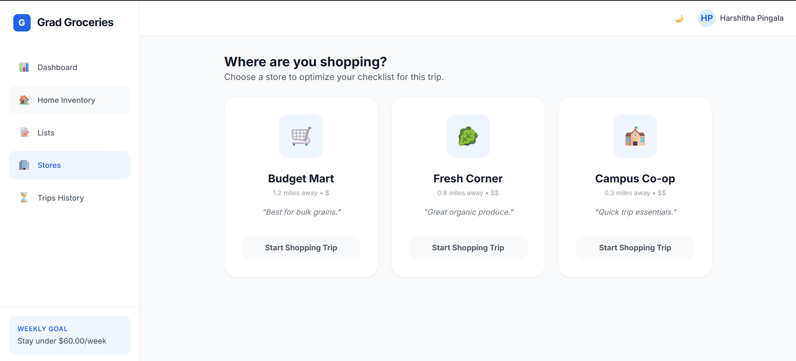
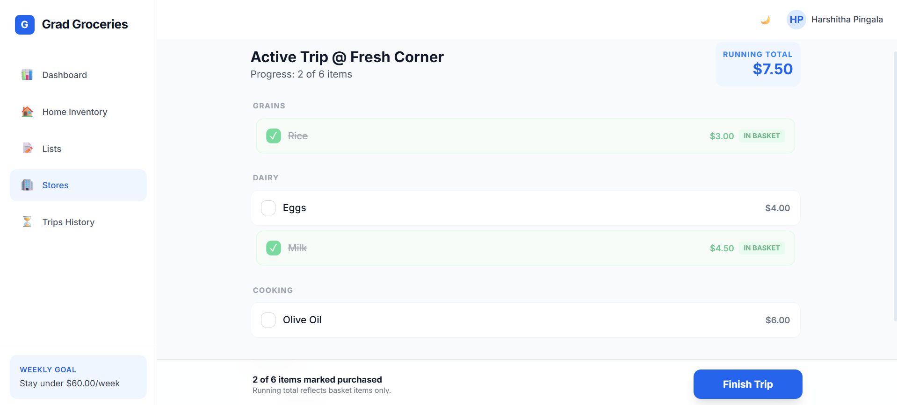
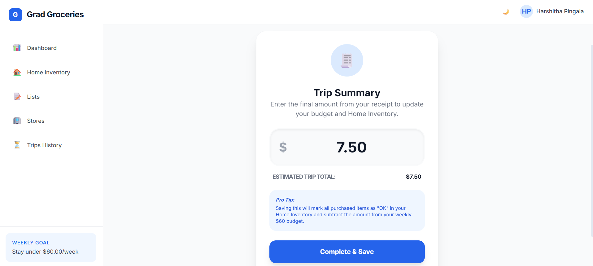
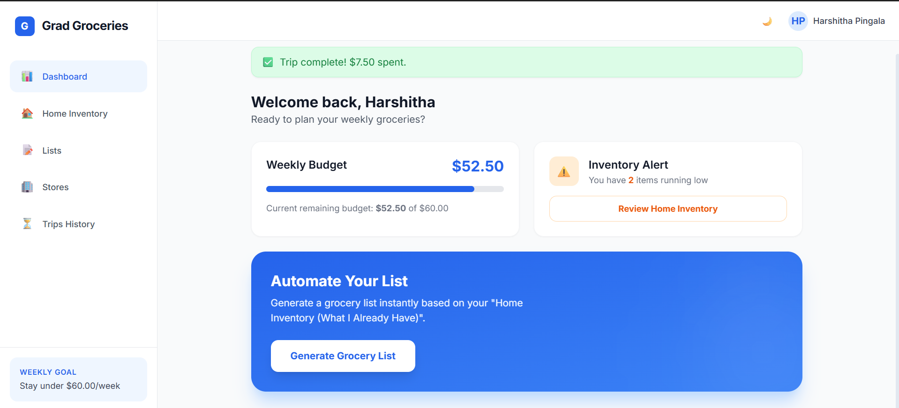
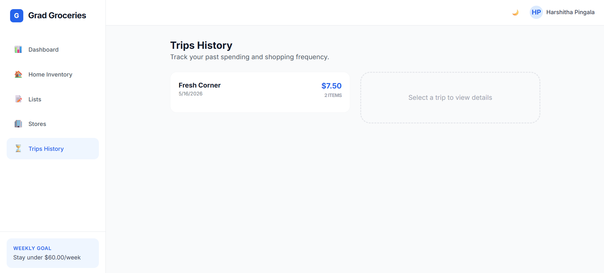

# Grad Grocery Planner

**Smart shopping for smart students.**

A grocery planning and budgeting web application designed for graduate students to reduce cognitive effort, time loss, and overspending during weekly grocery shopping.

---

## Live Demo

[View the app on Google AI Studio](https://ai.studio/apps/drive/1flJwQgq10aGziqJOk9CkIen1AujECWTF)

> Note: Requires a Google account to access. Screenshots of all screens are included below.

---

## The Problem

Graduate students lose an average of **26 hours and $780 annually** due to inefficient grocery planning. Shopping trips happen after classes and research commitments, when cognitive capacity is already depleted. The result: missed items, impulse purchases, and late budget realization at checkout.

Across approximately 3.2 million graduate students in the US, this translates to **$2.5 billion in unnecessary annual spending** and **83 million hours of lost time**.

**Root causes:**
- Fragmented planning information across notes, memory, and banking apps
- Cognitive overload during shopping after mentally demanding days
- No real-time budget visibility until checkout
- Unpredictable product availability requiring on-the-spot substitutions

---

## The Solution

Grad Grocery Planner transforms grocery shopping from a memory-driven activity into a guided, structured workflow. It centralizes inventory tracking, auto-generates lists based on low-stock thresholds, organizes items by category, tracks a running total against a weekly budget, and updates inventory after each trip.

**Position-to-own:** Low cognitive effort grocery shopping without delivery premiums.

| | Instacart | Manual Lists | Grad Grocery Planner |
|---|---|---|---|
| Time Required | Low | High | Low |
| Cognitive Effort | Low | High | Low |
| Cost | High | None | Low |
| Price Transparency | Medium | Low | High |

---

## Features

- **Secure Login** — Personalized profiles with saved budget, inventory, and trip history
- **Dashboard** — Weekly budget visibility and low-inventory alerts at a glance
- **Home Inventory Tracking** — Track quantities and set low-stock thresholds per item
- **Auto-Generated Grocery Lists** — One-click list generation based on low inventory items
- **Budget Estimation** — See estimated total vs weekly budget before shopping
- **Store Selection** — Choose from nearby stores to optimize your checklist
- **In-Store Checklist Mode** — Mark items as purchased with real-time running total
- **Trip Summary** — Enter receipt total to finalize and update inventory automatically
- **Trips History** — Review past spending and shopping patterns over time

---

## Screenshots

| Login | Dashboard | Smart List |
|-------|-----------|------------|
|  |  |  |

| Store Selection | Active Trip | Trip Summary |
|----------------|-------------|--------------|
|  |  |  |

| Post-Trip Dashboard | Trips History |
|--------------------|---------------|
|  |  |

---

## Product Thinking

**Target user:** Time-constrained graduate students with high cognitive load experiencing the most acute pain from grocery inefficiency. Budget-sensitive, digitally comfortable, and shopping weekly.

**Key product decisions:**
- Auto-generation from inventory thresholds removes the planning burden entirely
- Running total during shopping shifts budget awareness from checkout to cart
- Store selection with aisle-based organization reduces in-store decision fatigue
- Freemium model with $4.99/month subscription captures ~20% of the $234 annual value created per user

**Why not just use Instacart?** Delivery premiums, service fees, and price markups conflict with graduate student budgets. Why not a manual list? High mental effort, frequent missed items. Grad Grocery Planner occupies the white space: low effort and low cost simultaneously.

---

## Built With

- Google AI Studio (Gemini)
- TypeScript
- HTML, CSS

---

## About

Built by **Harshitha Pingala**
